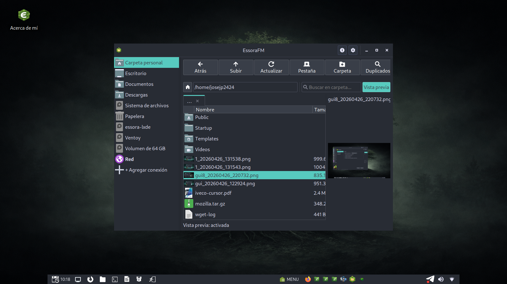
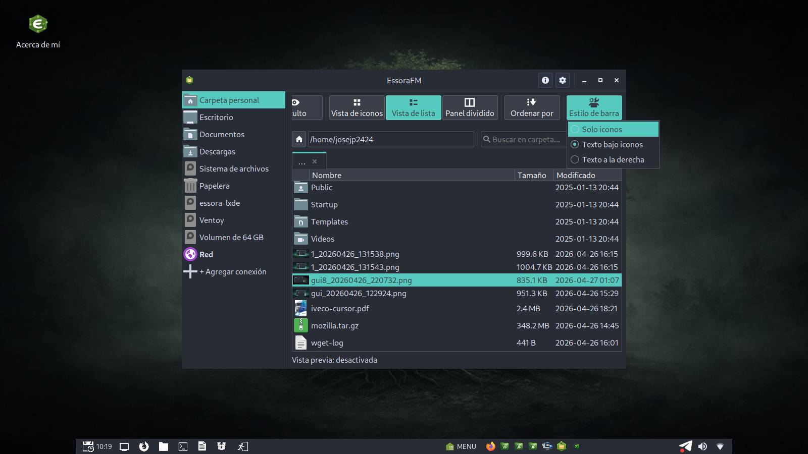
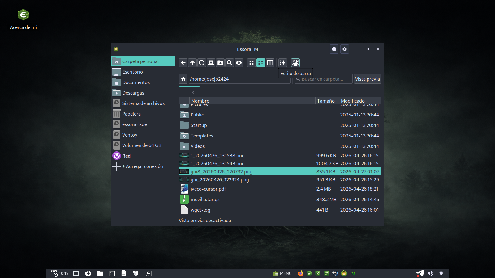
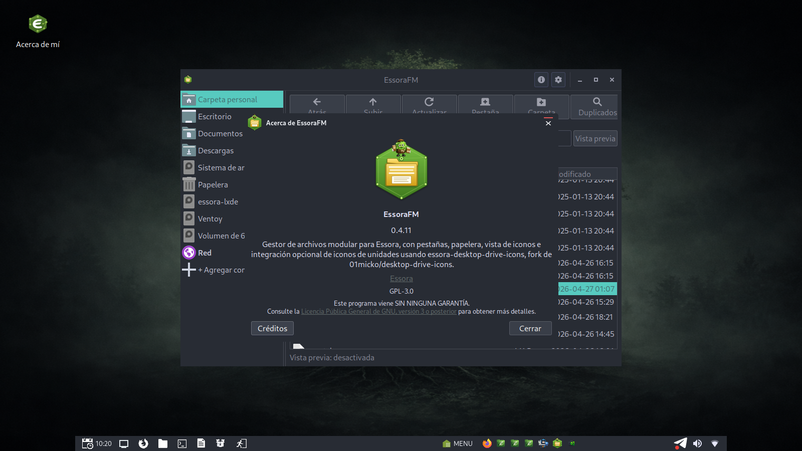
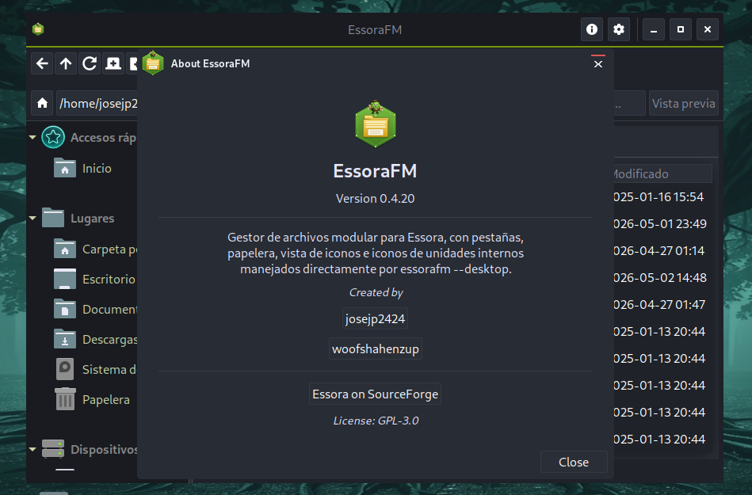
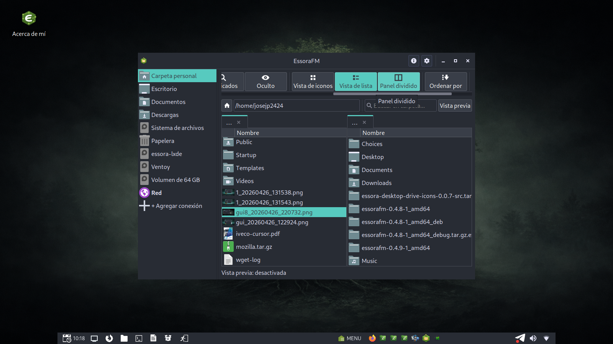

<div align="center">


# EssoraFM

**Modular GTK3 file manager for Essora Linux**

[](LICENSE)
[](https://github.com/josejp2424/essorafm/releases)
[]()
[]()
[]()

A lightweight, init-system-agnostic file manager designed for [Essora Linux](https://sourceforge.net/projects/essora/) — a Devuan-based distribution with OpenRC. Works on any Linux without systemd dependencies.

</div>

---

## Table of contents

- [Features](#features)
- [Screenshots](#screenshots)
- [Requirements](#requirements)
- [Installation](#installation)
- [Usage](#usage)
- [Keyboard shortcuts](#keyboard-shortcuts)
- [Configuration](#configuration)
- [Architecture](#architecture)
- [Internationalization](#internationalization)
- [Privilege escalation](#privilege-escalation)
- [Building from source](#building-from-source)
- [Troubleshooting](#troubleshooting)
- [Contributing](#contributing)
- [License](#license)
- [Credits](#credits)

---

## Features

### Core navigation
- **Tabbed browsing** with closable tabs and `Ctrl+T` / `Ctrl+W` shortcuts.
- **Sidebar with bookmarks**: Home, Desktop, Documents, Downloads, Filesystem, Trash, plus auto-detected mounted volumes.
- **Path bar** with integrated search.
- **Mount, unmount and eject** removable volumes via `udisks2`.
- **Two view modes**: icons (grid) and list (with name, size, modified columns).
- **Hidden files toggle**: toolbar button, `Ctrl+H`, or context menu.

### File operations
- **Copy, paste, move to trash, restore, delete permanently** — all standard operations.
- **`rsync`-backed copying** when available for large transfers, falls back to Python `shutil`.
- **XDG-compliant trash** at `~/.local/share/Trash` with `.trashinfo` metadata.
- **Open with...** — submenu listing applications registered for the file's MIME type via `Gio.AppInfo`, plus an "Other application..." option that launches `Gtk.AppChooserDialog`.

### Preview panel
Optional side preview for the selected file. Toggleable from the toolbar and persisted across sessions.

| Format            | Backend                                          |
| ----------------- | ------------------------------------------------ |
| PNG, JPG, WEBP, BMP, GIF, TIFF, SVG | `GdkPixbuf` native loader |
| TXT, LOG, MD, CONF, INI, DESKTOP, SH, PY, JSON, XML, CSS | Python text reader (Cairo when available) |
| PDF (first page)  | `pdftoppm` from `poppler-utils`                  |
| EPUB (cover)      | Python `zipfile` extracting embedded cover image |

If a backend is missing, EssoraFM falls back gracefully to the standard file icon.

### Duplicate scanner
Built-in duplicate file finder accessible from the toolbar and right-click menu. Optimized for large folders: it first groups candidates by file size, and only then computes hashes for actual collision candidates.

### Network bookmarks
Connect to SMB, FTP, SFTP and WebDAV shares. Bookmarks are stored locally and reconnected on demand from the sidebar.

### Desktop integration (optional)
- Show drive icons on the desktop (uses `essora-desktop-drive-icons`, forked from [01micko/desktop-drive-icons](https://github.com/01micko/desktop-drive-icons)).
- Configurable autostart, drive icon size, and what types to show (internal / removable / network).
- Send images to `/usr/share/backgrounds` directly from the context menu.
- Run files in a console with one click.

### Configurable interface
Persistent across sessions via `~/.config/essorafm/config.ini`:

- View mode (icons / list).
- Icon sizes for grid, list, sidebar and toolbar — independent.
- Single click to open.
- Show hidden files at startup.
- Show thumbnails (image previews in icon view).
- Window size — three presets (`640×480`, `880×550`, `1040×680`) and a fully custom width × height range (640–3840 × 480–2160).
- Sidebar layout (classic / compact).
- Sort field (name / size / modified / type) and direction.
- Toolbar style (icons only / text below / text right).

### Internationalization
Full UI translations for **12 languages**: English, Spanish, Catalan, German, French, Italian, Portuguese, Hungarian, Japanese, Russian, Chinese, Arabic. Language is auto-detected from `$LANG` / system locale.

---

## Screenshots

<div align="center">

<table>
<tr>
<td align="center" width="50%">
<br>
<sub><b>Main window</b></sub>
</td>
<td align="center" width="50%">
<br>
<sub><b>Preview panel</b></sub>
</td>
</tr>
<tr>
<td align="center" width="50%">
<br>
<sub><b>Preferences</b></sub>
</td>
<td align="center" width="50%">
<br>
<sub><b>Duplicate scanner</b></sub>
</td>
</tr>
<tr>
<td align="center" width="50%">
<br>
<sub><b>Network bookmarks</b></sub>
</td>
<td align="center" width="50%">
<br>
<sub><b>About</b></sub>
</td>
</tr>
</table>

</div>

---

## Requirements

### Runtime dependencies (Debian/Devuan package names)
- `python3` (≥ 3.8)
- `python3-gi`
- `python3-gi-cairo`
- `gir1.2-gtk-3.0`
- `gir1.2-gdkpixbuf-2.0`
- `gir1.2-glib-2.0`
- `gir1.2-pango-1.0`
- `udisks2`

### Optional dependencies
- `rsync` — accelerated copying with progress.
- `poppler-utils` — PDF thumbnails and previews (`pdftoppm`).
- `policykit-1` *or* `gksu` — privilege escalation for system-protected operations.
- `xdg-utils` — `xdg-open` fallback for "Open with default application".

### Tested on
- Essora Linux (Devuan Excalibur base, OpenRC)
- Devuan Daedalus / Excalibur
- Debian 12 Bookworm

EssoraFM has **no systemd dependency**, so it runs equally well on systemd, OpenRC, runit or s6 systems.

---

## Installation

### Option 1 — `.deb` package (recommended)

Download the latest release from [Releases](https://github.com/josejp2424/essorafm/releases) or [SourceForge](https://sourceforge.net/projects/essora/) and install:

```bash
sudo dpkg -i essorafm_0.4.11-1_amd64.deb
sudo apt-get install -f   # resolve dependencies if needed
```

### Option 2 — From the tar archive

```bash
tar -xzf essorafm-0_4_11-1_amd64_tar.gz
cd essorafm-0.4.11-1_amd64
sudo cp -rv usr/* /usr/

# Clean any old bytecode cache (important when upgrading)
sudo find /usr/local/essorafm -name '__pycache__' -type d -exec rm -rf {} +
sudo find /usr/local/essorafm -name '*.pyc' -delete
```

### Option 3 — From source

```bash
git clone https://github.com/josejp2424/essorafm.git
cd essorafm
sudo cp -rv usr/* /usr/
```

### Verify installation

```bash
which essorafm                       # → /usr/local/bin/essorafm
essorafm --version 2>/dev/null || essorafm
```

### Uninstall

```bash
sudo rm -rf /usr/local/essorafm
sudo rm -f /usr/local/bin/essorafm
sudo rm -f /usr/share/applications/essorafm.desktop
```

User config at `~/.config/essorafm/` is preserved unless removed manually.

---

## Usage

### Launch
- From the application menu: *System → EssoraFM*
- From a terminal: `essorafm`
- With a starting path: `essorafm /home/user/Pictures`

### Right-click menu
On any file or folder you get:
- **Open** — uses the default application
- **Open with...** — submenu of every app registered for the MIME type, plus *Other application...*
- **Copy** — into the internal clipboard
- **Move to trash** / **Delete permanently**
- **Restore** (when inside trash)
- **Run in console** (when relevant)
- **Send to backgrounds** (for image files)
- **Paste here**, **New folder**, **Refresh**, **Show hidden** (always available on empty area)

---

## Keyboard shortcuts

| Shortcut         | Action                              |
| ---------------- | ----------------------------------- |
| `Ctrl+T`         | New tab                             |
| `Ctrl+W`         | Close current tab                   |
| `Ctrl+L`         | Focus the path bar                  |
| `Ctrl+H`         | Toggle hidden files                 |
| `Ctrl+,`         | Open Preferences                    |
| `Ctrl+C`         | Copy selected to internal clipboard |
| `Ctrl+V`         | Paste                               |
| `F5`             | Refresh current view                |
| `Delete`         | Move to trash                       |
| `Shift+Delete`   | Delete permanently                  |

---

## Configuration

EssoraFM stores its config at:

```
~/.config/essorafm/config.ini
```

Format:

```ini
[Main]
view_mode = icons
icon_size = 64
list_icon_size = 32
sidebar_icon_size = 32
toolbar_icon_size = 20
show_hidden = false
single_click = false
show_thumbnails = true
preview_enabled = true
window_width = 880
window_height = 550
sidebar_layout = classic
sort_field = name
sort_direction = asc
desktop_drive_icons = true
desktop_drive_icon_size = 48
desktop_drive_show_internal = true
desktop_drive_show_removable = true
desktop_drive_show_network = false
```

The file is created automatically on first run with sane defaults. All UI preferences are mirrored into it on save.

Network bookmarks are stored in:

```
~/.config/essorafm/network_bookmarks.json
```

---

## Architecture

```
/usr/local/essorafm/
├── essorafm.py              # entrypoint
├── app/
│   ├── window.py            # main window, layout, key bindings
│   ├── tabs.py              # tab notebook, close buttons
│   ├── fileview.py          # icon/list view + context menu
│   ├── sidebar.py           # places + volumes sidebar
│   ├── pathbar.py           # path bar with integrated search
│   ├── toolbar.py           # top toolbar
│   ├── preview_panel.py     # right-side preview panel
│   ├── dialogs.py           # Preferences, Copy progress, About
│   ├── duplicates.py        # duplicate scanner UI
│   ├── network_dialog.py    # SMB/FTP/SFTP bookmarks UI
│   └── desktop.py           # desktop drive icons window
├── core/
│   ├── settings.py          # paths, constants
│   ├── settings_manager.py  # config.ini read/write
│   ├── desktop_settings.py  # desktop-drive-icons config
│   ├── filesystem.py        # directory listing, MIME detection
│   ├── copy_engine.py       # rsync + Python fallback
│   ├── privilege.py         # pkexec / gksu helper
│   └── i18n.py              # 12-language string table
├── services/
│   ├── icon_loader.py       # GdkPixbuf icon caching
│   ├── thumbnailer.py       # async thumbnail generation
│   ├── previewer.py         # preview backends per format
│   ├── trash.py             # XDG-compliant trash
│   ├── volumes.py           # udisks2 mount/unmount/eject
│   └── network_bookmarks.py # network bookmarks persistence
└── ui/
    ├── icons/               # SVG/PNG icon assets
    └── styles.css           # GTK CSS theming
```

The codebase follows a **strict separation of concerns**:

- `app/` — GTK widgets and event handlers only.
- `core/` — pure logic, no GTK imports outside `Gio` data classes.
- `services/` — long-lived stateful helpers (icon caches, trash, thumbnails).

This allows individual modules to be tested or replaced without touching the UI layer.

---

## Internationalization

UI strings live in [`core/i18n.py`](core/i18n.py) under a `STRINGS` dict. The active language is detected from `$LANG`, falling back to English.

Supported languages out of the box:

| Code | Language    | Code | Language    |
| ---- | ----------- | ---- | ----------- |
| `en` | English     | `pt` | Portuguese  |
| `es` | Spanish     | `hu` | Hungarian   |
| `ca` | Catalan     | `ja` | Japanese    |
| `de` | German      | `ru` | Russian     |
| `fr` | French      | `zh` | Chinese     |
| `it` | Italian     | `ar` | Arabic      |

To add a new language, edit `core/i18n.py` and add an entry to the `updates` dict with your translations. Spanish acts as the secondary fallback before English, so any missing key will surface in Spanish first, then English.

To force a language regardless of system locale:

```bash
LANG=ja_JP.UTF-8 essorafm
```

---

## Privilege escalation

When an operation fails with `EPERM`/`EACCES` (e.g. deleting a file owned by root), EssoraFM transparently retries the action via `pkexec`. If `pkexec` is not available, it falls back to `gksu`. The user gets a single PolicyKit prompt and the operation continues.

This is implemented in [`core/privilege.py`](core/privilege.py) and triggered from:
- Move to trash
- Delete permanently
- Restore from trash
- Create folder
- Paste (copy)

EssoraFM **never** requests elevated privileges preemptively — only when the kernel actually denies the operation.

---

## Building from source

To rebuild the `.deb` package:

```bash
# from the project root, where DEBIAN/control sits
fakeroot dpkg-deb --build essorafm-0.4.11-1_amd64
```

To create a portable tarball:

```bash
tar -czf essorafm-0_4_11-1_amd64_tar.gz essorafm-0.4.11-1_amd64/
```

There is no compilation step — EssoraFM is pure Python.

---

## Troubleshooting

### Settings reset on every launch
Ensure `~/.config/essorafm/` is writable by the user. Delete `config.ini` to regenerate defaults:
```bash
rm ~/.config/essorafm/config.ini
```

### Thumbnails for PDF do not appear
Install Poppler:
```bash
sudo apt install poppler-utils
```

### Right-click context menu missing "Delete" or "Open with..."
Clear bytecode cache and restart:
```bash
sudo find /usr/local/essorafm -name '__pycache__' -type d -exec rm -rf {} +
sudo find /usr/local/essorafm -name '*.pyc' -delete
pkill -f essorafm
essorafm
```

### Volumes do not mount
Verify `udisks2` is installed and running:
```bash
sudo apt install udisks2
udisksctl status
```

### App locks up on a large folder
EssoraFM lists synchronously. Avoid running it on directories with hundreds of thousands of entries (e.g. `/proc`, mass-extracted archives). Use a terminal for those.

### Reset everything to defaults
```bash
rm -rf ~/.config/essorafm
```

---

## Contributing

Pull requests are welcome. The codebase is small enough to read end-to-end in an afternoon.

When opening a PR:
1. Keep changes surgical — modify only the files relevant to the issue.
2. Preserve the i18n layer — every new user-facing string must land in `core/i18n.py` for at least English and Spanish.
3. Avoid systemd-only APIs. EssoraFM ships on OpenRC distros.
4. Test on at least one Devuan or non-systemd Debian derivative when touching mount/unmount or autostart code.

Bug reports go in the [issue tracker](https://github.com/josejp2424/essorafm/issues). Please include:
- EssoraFM version (visible in *About*)
- Distribution and init system
- Output of `essorafm` from a terminal at the moment of the bug

---

## License

EssoraFM is released under the **GNU General Public License v3.0 or later**. See [LICENSE](LICENSE) for the full text.

```
Copyright (C) 2024–2026 josejp2424
This program is free software: you can redistribute it and/or modify
it under the terms of the GNU General Public License as published by
the Free Software Foundation, either version 3 of the License, or
(at your option) any later version.
```

---

## Credits

- **Author and maintainer**: josejp2424
- **Co-author**: Nilsonmorales [Woofshahenzup](https://github.com/Woofshahenzup)
- **Desktop drive icons**: forked from [01micko/desktop-drive-icons](https://github.com/01micko/desktop-drive-icons)
- **Default theme**: adapted from the Catppuccin Mocha palette
- **Tested and shipped with**: [Essora Linux](https://sourceforge.net/projects/essora/)

---

<div align="center">

Made with patience and a lot of `Ctrl+R` for [Essora Linux](https://sourceforge.net/projects/essora/) ♥

</div>
